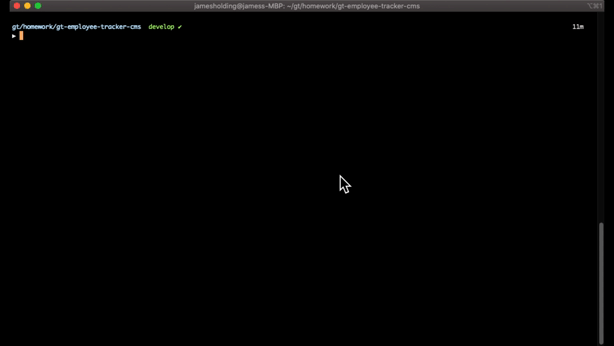
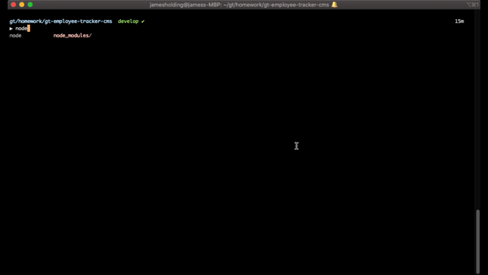
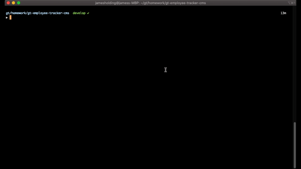

Employee Tracker

## Introduction
This application was designed to be a CMS so that the user can input details regarding their orgazational structure.

## Table of Contents
- [Introduction](#Introduction)
- [Table of Contents](#table-of-contents)
- [Installation](#installation)
- [Usage](#usage)
- [Credits](#credits)
- [License](#license)

### Installation
Clone this repo to your local machine using https://github.com/jmh129/gt-note-taker

Note: Make sure to run npm install as this application makes use of node packages. 

### Usage
To use the application the user just needs to run the CLI and will be greeted with a list of actionable items for the user to use. The user can navigate through the list whther its, add an employee, add a department, view the budget, or delete an employee. The current functionality
includeds:
  View All Records 
  View Employees 
  Add Employee 
  View Department 
  Add Department 
  View Roles 
  Add Roles
  Update Employee Role 
  Delete Employee 
  View Budget

  With more to come!

### Example Demo:

### View All Records

### Add Employee

### View Departmental Budget

### Credits
Credit to the Georgia Institute of Technology Coding Bootcamp for the instruction for the assignemnt. 

### License

MIT License

Copyright (c) 2020 James Holding

Permission is hereby granted, free of charge, to any person obtaining a copy
of this software and associated documentation files (the "Software"), to deal
in the Software without restriction, including without limitation the rights
to use, copy, modify, merge, publish, distribute, sublicense, and/or sell
copies of the Software, and to permit persons to whom the Software is
furnished to do so, subject to the following conditions:

The above copyright notice and this permission notice shall be included in all
copies or substantial portions of the Software.

THE SOFTWARE IS PROVIDED "AS IS", WITHOUT WARRANTY OF ANY KIND, EXPRESS OR
IMPLIED, INCLUDING BUT NOT LIMITED TO THE WARRANTIES OF MERCHANTABILITY,
FITNESS FOR A PARTICULAR PURPOSE AND NONINFRINGEMENT. IN NO EVENT SHALL THE
AUTHORS OR COPYRIGHT HOLDERS BE LIABLE FOR ANY CLAIM, DAMAGES OR OTHER
LIABILITY, WHETHER IN AN ACTION OF CONTRACT, TORT OR OTHERWISE, ARISING FROM,
OUT OF OR IN CONNECTION WITH THE SOFTWARE OR THE USE OR OTHER DEALINGS IN THE
SOFTWARE.